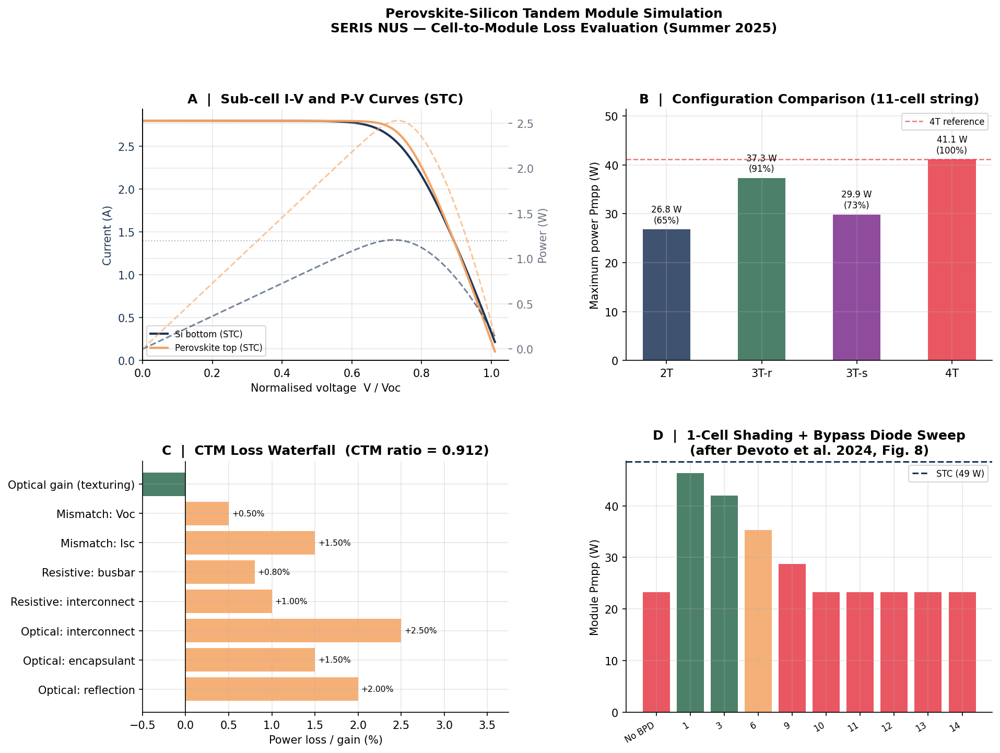

# tandem-solar

Python simulation toolkit for perovskite-silicon tandem solar cell modules. Covers I-V modelling, terminal configurations (2T/3T/4T), cell-to-module (CTM) loss analysis, and bypass diode protection under partial shading.

Based on work at the **Solar Energy Research Institute of Singapore (SERIS), NUS** — internship project on cell-to-module loss evaluation for next-generation tandem solar technology (Summer 2025).

Related publication:
> Devoto et al. (2024). *Modelling the effects of tandem module circuit configurations.* 41st EU PVSEC. [doi:10.4229/EUPVSEC2024/2BV.1.41](https://doi.org/10.4229/EUPVSEC2024/2BV.1.41)

---

## What this covers

```
Perovskite-Silicon Tandem Cell
  ├── Perovskite top cell   (Voc ≈ 1.3 V, high bandgap)
  └── Silicon bottom cell   (Voc ≈ 0.65 V, IBC technology)

Terminal configurations:
  2T  — monolithic, series-connected (current-matched)
  3T  — three terminals (3T-r recombination, 3T-s series)
  4T  — mechanically stacked, fully independent
```

---

## Modules

| Module | Contents |
|---|---|
| `cell_model.py` | Single-diode model (SDM): I-V curves, parameter extraction, temperature/irradiance scaling |
| `tandem.py` | 2T, 3T-r, 3T-s, 4T configuration models; end-loss analysis |
| `ctm_loss.py` | CTM loss waterfall: optical, resistive, mismatch; Isc mismatch Monte Carlo |
| `shading.py` | Partial shading + bypass diode sweep, reproducing Devoto et al. Fig. 8 |

---

## Installation

```bash
git clone https://github.com/defnalk/tandem-solar.git
cd tandem-solar
pip install -r requirements.txt
```

## Quick Start

```python
from tandem import SolarCell, TandemModule, CTMLossAnalyser, ShadingAnalysis
from tandem.cell_model import SILICON_PARAMS, PEROVSKITE_PARAMS

# I-V curve for a silicon IBC sub-cell
si = SolarCell(SILICON_PARAMS)
V, I, P = si.iv_curve()
print(f"Silicon: Voc={SILICON_PARAMS.Voc:.2f} V, FF={SILICON_PARAMS.FF:.3f}")

# 11-cell tandem string — compare configurations
mod = TandemModule(n_cells=11)
comp = mod.compare_configurations()
for config, vals in comp.items():
    print(f"{config}: Pmpp={vals['Pmpp']:.1f} W  ({vals['rel_eff']*100:.0f}% of 4T)")

# CTM loss breakdown
ctm = CTMLossAnalyser(n_cells_series=11)
summary = ctm.loss_summary()
print(f"\nCTM ratio: {summary['ctm_ratio']:.3f}")
print(f"Cell sum → Module: {summary['P_cell_sum_W']:.1f} W → {summary['P_module_W']:.1f} W")

# Bypass diode sweep
sa = ShadingAnalysis(n_cells=22)
sweep = sa.bypass_diode_sweep()
```

## Run the Full Simulation

```bash
python examples/full_simulation.py
```

Generates a 4-panel figure:



**Panels:**
- **A** — Normalised I-V and P-V curves for perovskite and silicon sub-cells
- **B** — Configuration comparison: 2T / 3T-r / 3T-s / 4T Pmpp (11-cell string)
- **C** — CTM loss waterfall — 8.8% total loss, CTM ratio = 0.912
- **D** — Bypass diode sweep (reproducing Devoto et al. Fig. 8)

## Running Tests

```bash
python -m pytest tests/ -v
```

31 tests, all passing.

---

## Physics Background

### Single-Diode Model

The standard SDM describes cell current implicitly:

```
I = I_ph − I_0·[exp((V + I·Rs)/(n·Vt)) − 1] − (V + I·Rs)/Rsh
```

Solved numerically using Brent's method at each voltage point.

### Terminal Configurations

| Config | Matching | End losses | Key property |
|---|---|---|---|
| **2T** | Current-matched | None | Simplest; current mismatch penalising |
| **3T-r** | Voltage-matched | Low (1 cell) | Better than 3T-s; BPD works like 2T |
| **3T-s** | Voltage-matched | High (3 cells) | No effective BPD implementation known |
| **4T** | Independent | None | Best efficiency; highest cost |

### CTM Loss Mechanisms

```
Cell Pmax sum (100%)
    − Optical reflection      (2.0%)
    − Encapsulant absorption  (1.5%)
    − Interconnect shading    (2.5%)
    − Interconnect resistance (1.0%)
    − Busbar resistance       (0.8%)
    − Isc mismatch            (1.5%)
    − Voc mismatch            (0.5%)
    + Light trapping gain    (+1.0%)
    ─────────────────────────────
    = Module power (CTM ratio ≈ 0.91)
```

### Bypass Diode Protection (reproducing Devoto et al. 2024)

In a 22-cell 2T string with one shaded cell:

| Cells under BPD | Power | vs STC |
|---|---|---|
| 0 (no BPD) | ~22 W | 48% |
| 1 cell | ~44 W | 95% ← best |
| 3 cells | ~40 W | 86% |
| 9 cells | ~27 W | 59% |
| 10+ cells | ~22 W | 48% ← no improvement |

Key finding: one bypass diode can protect up to **9 tandem cells** in this module. Beyond that, the silicon bottom cell Vbd (≈ −3.7 V for IBC) is too low to prevent perovskite top cell reverse bias degradation before the diode activates.

### Perovskite Stability Challenge

Perovskite sub-cells have breakdown voltage Vbd ≈ −1 to −5 V — far lower than silicon PERC (Vbd > −20 V). This means:
- Standard bypass diode placement (1 per 20 cells) is **insufficient** for tandems
- IBC silicon's soft breakdown (Vbd ≈ −3.7 V) that benefits single-junction modules becomes a **disadvantage** in 3T tandem bottom cells
- 3T-s has no known effective bypass diode solution

## References

- Devoto et al. (2024). Modelling the effects of tandem module circuit configurations. *41st EU PVSEC.* doi: 10.4229/EUPVSEC2024/2BV.1.41
- McMahon et al. (2021). Homogenous voltage-matched strings using three-terminal tandem solar cells. *IEEE J. Photovolt.*
- Chu et al. (2015). Soft breakdown behavior of IBC silicon solar cells. *Energy Procedia.*
- Di Girolamo et al. (2024). Silicon/perovskite tandem solar cells with reverse bias stability down to −40 V. *Adv. Sci.*

## Author

**Defne Ertugrul** — MEng Chemical Engineering, Imperial College London  
Research internship: SERIS (Solar Energy Research Institute of Singapore), NUS, July 2025  
Supervisor: Dr. Romika Sharma — Next Generation Industrial Solar Cells and Modules Cluster
